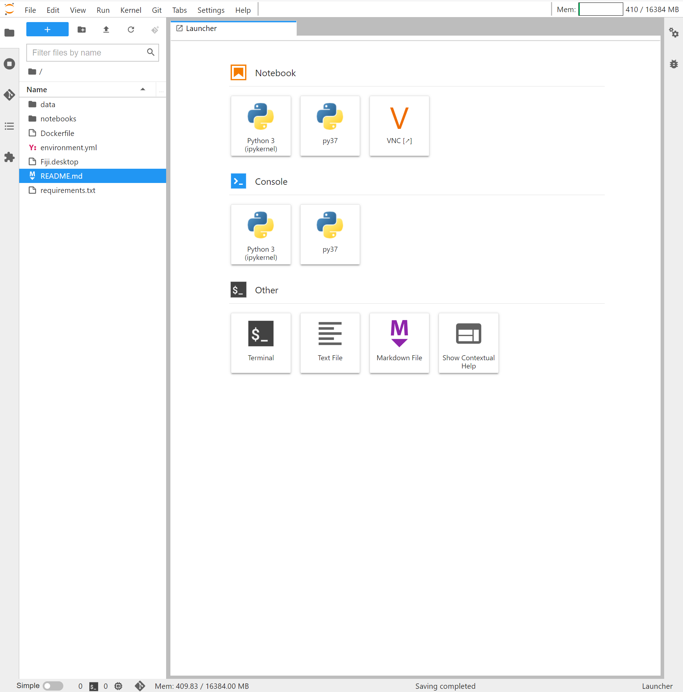
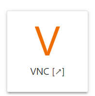
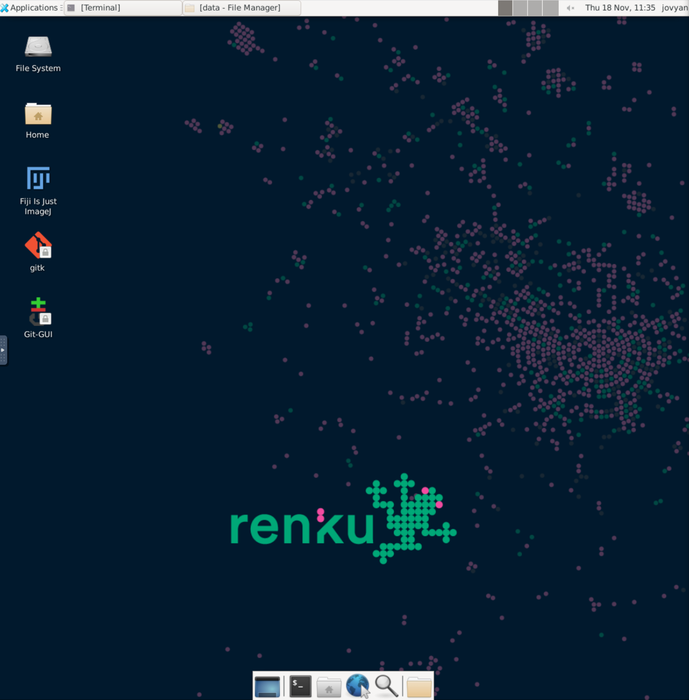
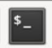
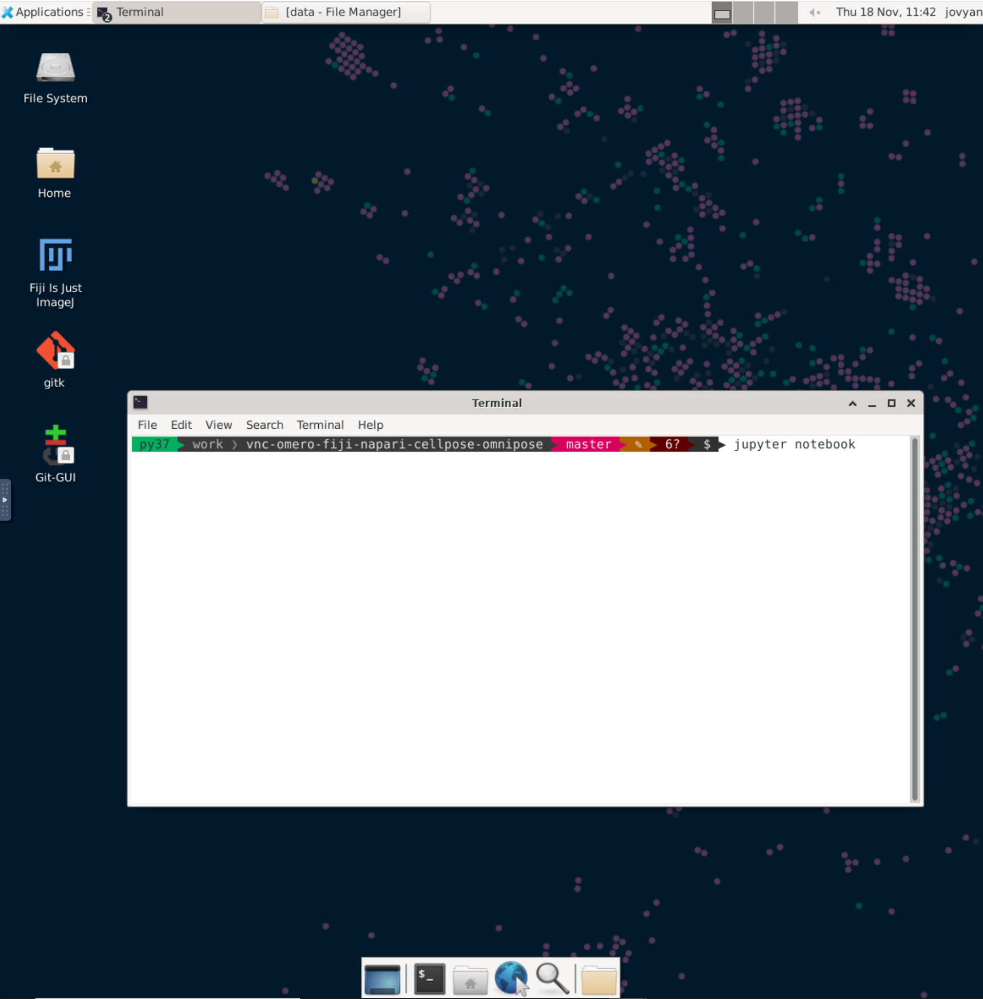
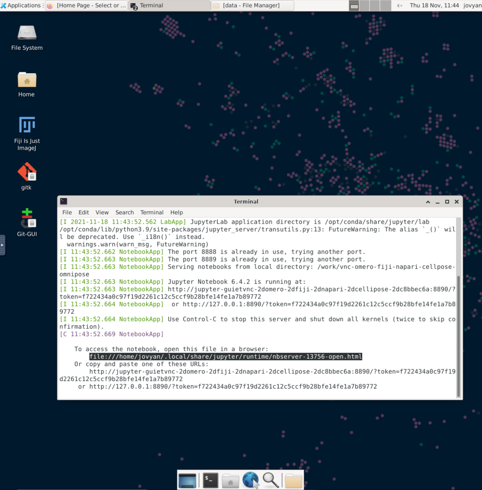
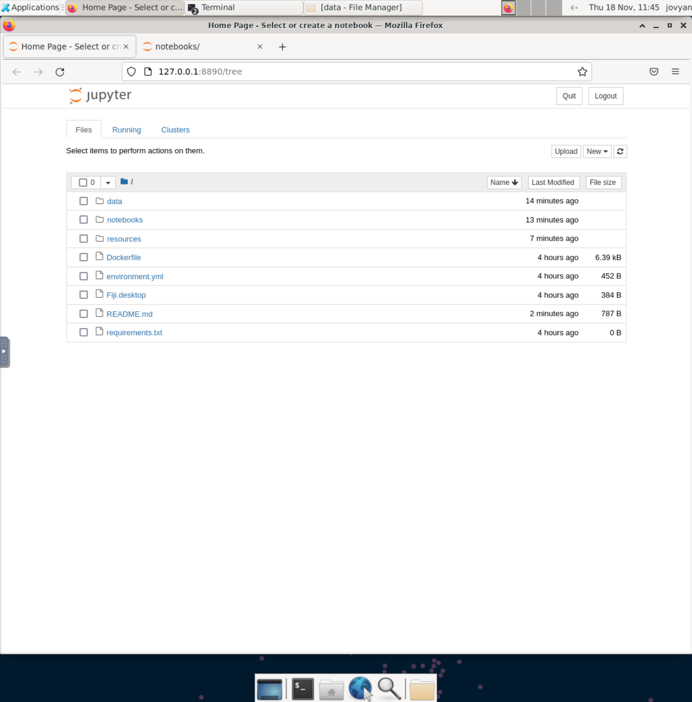

# vnc-omero-fiji-napari-cellpose-omnipose

## Introduction

This is a Renku project - basically a git repository with some
bells and whistles. You'll find we have already created some
useful things like `data` and `notebooks` directories.

## Working with the project

### Start a session
The simplest way to start your project is right from the Renku
platform - just click on the `Sessions` tab and start a new session.
This will start an interactive environment right in your browser.

### Use Desktop and Jupyter notebooks

You will arrive on RENKU 

You can click on the VNC icon  to start a 

You can can click on the terminal icon 

Type 'jupyter notebook' 

Select and right-clic 'Open Link' 

Navigate to the notebooks folder  
and start a notebook.